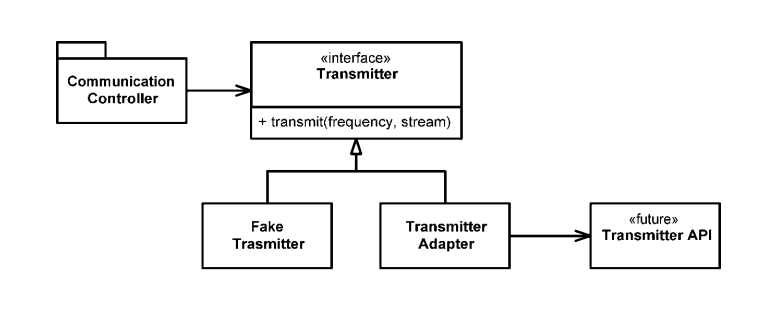

# Chapter 8: Boundaries

We seldom control all the software in our systems. Sometimes we buy third-party packages or use open source. Other times we depend on teams in our own company to produce
components or subsystems for us. Somehow we must cleanly integrate this foreign code with our own. In this chapter we look at practices and techniques to keep the boundaries of
our software clean.

## Using Third-Party Code

There is a natural tension between the provider of an interface and the user of an interface. `Providers` of third-party packages and frameworks strive for broad applicability so they can work in many environments and appeal to a wide audience. `Users`, on the other hand, want an interface that is focused on their particular needs. This tension can cause problems at the boundaries of our systems.

Let’s look at `java.util.Map` as an example. As you can see, Maps have a very broad interface with plenty of capabilities. Certainly this power and flexibility is useful, but it can also be a liability.

```java
// The methods of Map
- clear() void – Map
- containsKey(Object key) boolean – Map
- containsValue(Object value) boolean – Map
- entrySet() Set – Map
- equals(Object o) boolean – Map
- get(Object key) Object – Map
- ...
```

Our intention might be that none of the recipients of our Map delete anything in the map. But right there at the top of the list is the `clear()` method. Any user of the Map has the power to clear it.

If our application needs a Map of Sensors, you might find the sensors set up like this:

```java
Map sensors = new HashMap();
```

Then, when some other part of the code needs to access the sensor, you see this code:

```java
Sensor s = (Sensor)sensors.get(sensorId );
```

We don’t just see it once, but over and over again throughout the code. The client of this code carries the responsibility of getting an Object from the Map and casting it to the right type. This works, but it’s not clean code.

A cleaner way to use Map might look like the following. That choice has become (and always should be) an implementation detail.

```java
public class Sensors {
    private Map sensors = new HashMap();

    public Sensor getById(String id) {
        return (Sensor) sensors.get(id);
    }

    //snip
}
```

The interface at the boundary (`Map`) is hidden. It is able to evolve with very little impact on the rest of the application. This interface is also tailored and constrained to meet the needs of the application. It results in code that is easier to understand and harder to misuse. The `Sensors` class can enforce design and business rules.

## Using Code That Does Not Yet Exist

There is another kind of boundary, one that separates the known from the unknown. Sometimes what is on the other side of the boundary is unknowable.

For example, in a radio communications system, there is a subsystem, the "Transmitter", that little is known about, and the people responsible for the subsystem has not gotten to the point of defining their interface.

There is no idea how that will be done because the API is not been designed yet. To keep from being blocked, define your own interface, calling it something like `Transmitter`. Give it a method called `transmit` that takes a frequency and a data stream. This is the interface you wish you have.

By using your own application specific interface, you keep your `CommunicationsController` code clean and expressive. Once the transmitter API is defined, write the `TransmitterAdapter` to
bridge the gap. The ADAPTER2 encapsulated the interaction with the API and provides a single place to change when the API evolves.



This design also gives a very convenient seam in the code for testing. Using a suitable `FakeTransmitter`, you can test the `CommunicationsController` classes. you can also create boundary tests once you have the `TransmitterAPI` that make sure you are using the API correctly.
